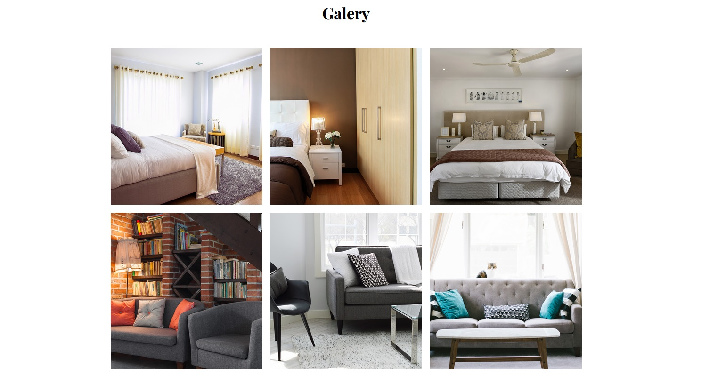

  
  

# Furniture Store Landing Page

This is a project for a course, created for practice, of a simple Landing Page using HTML and CSS with an E-commerce Furniture Store theme.

## Description

This basic Landing Page was created as an exercise to showcase web design and layout skills using HTML and CSS. The chosen theme is that of an E-commerce site, where products and promotions can be displayed attractively and modernly.

## Features

- Elegant and modern design.
- Uses only HTML and CSS.
- E-commerce site theme.
- Easy to customize and adapt to different needs.

## Usage Instructions

1. Clone or download the repository.
2. Open the index.html file in your browser to view the Landing Page.
3. Customize the content according to your needs as it is filled with lorem ipsum.

## Screenshots

Below are some screenshots of the Furniture Store Landing Page:

### Home Page

     This section showcases the elegant and modern design of the home page, featuring attractive furniture and layout.

### Categories and About us

     Navigate through different sections like Categories and About us.

### Products

     Explore a curated selection of premium furniture items on the products page, with detailed product descriptions and pricing.

### Galery

     The gallery page presents a collection of stunning furniture images, highlighting the range of products available.

### Get in touch

     Reach out to us easily using the "Get in Touch" page, where you can find contact information and a simple form to get in contact with us.

## Author

- Alexis Manuel Hurtado García (<https://github.com/alastor-4>)
